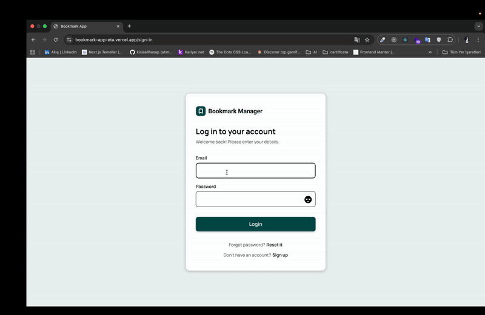

# 🔖 Bookmark App

- A modern bookmark management application built with **Next.js**, **React**, and **Firebase**.
- Save, organize, and filter your bookmarks — with role-based (admin/user) access control.

---

## ✨ Features

📚 **Full CRUD Functionality**  
Add, edit, delete, and view bookmarks easily.

🧭 **Filtering System**  
Filter bookmarks by tag, user, or category.

👑 **Admin Access**  
Admins can view all bookmarks; users see only their own.

🔐 **Firebase Integration**  
Authentication, Firestore database, and real-time updates.

🎨 **Modern UI**  
Responsive and elegant interface with **TailwindCSS** and **Framer Motion** animations.

🕒 **Smart Time Formatting**  
Powered by **Moment.js** for displaying creation and update times.

## ⚡ Tech Stack

- **Next.js 16** – React framework
- **React 19** – UI library
- **Firebase** – Auth & Firestore database
- **TailwindCSS** – Styling
- **Framer Motion** – Animations
- **Moment.js** – Time formatting
- **React Hot Toast** – Notifications
- **UUID** – Unique ID generation
- **Next Themes** – Dark/Light theme support

## 🧩 Project Highlights

- Real-time bookmark synchronization with Firestore
- Clean and minimalistic UI
- Role-based rendering (Admin vs. User)
- Fully responsive for all screen sizes

---

Live:https://bookmark-app-eta.vercel.app

Github:https://github.com/kisisellhesap/bookmark-app

